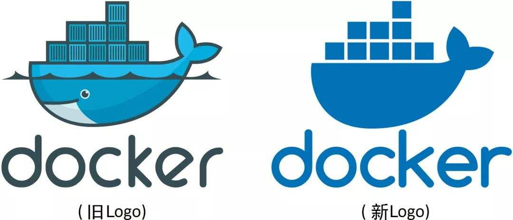

# Docker简介

## Docker历史

2010 年，几个搞 IT 的年轻人，在美国旧金山成立了一家名叫 `dotCloud` 的公司。dotCloud 的平台即服务（Platform-as-a-Service, PaaS）提供商。底层技术上，dotCloud 平台利用了 Linux 的 LXC 容器技术。

为了方便创建和管理这些容器，dotCloud 基于 Google 公司推出的 Go 语言开发了一套内部工具，之后被命名为 `Docker`。Docker 就是这样诞生的。

*提示：“Docker” 一词来自英国口语，意为码头工人（Dock Worker），即从船上装卸货物的人。*

> LXC 是 Docker 的底层基石，但是在 Docker 0.9 版本的时候，Docker 见异思迁了，引入了基于 Go 语言构建的 Libcontainer 的 execution driver。有了 Libcontainer 这个项目，Docker 不再需要依赖于 Linux 部件（LXC，libvirt，systemd-nspawn...）就可以处理 namespaces、control groups、capabilities、apparmor profiles、network interfaces。这下，LXC 沦为可选项。

在 Docker 1.8 中 LXC 被 deprecated，`在 Docker 1.10，LXC 彻底出局`。Docker 推出 Libcontainer 自己集成了 Linux 内核中的很多特性，作为一个独特、稳定且不受制于 Linux 的 Library，独立的时代终于到来了。

如同 Docker 的 Logo 一样，Docker 的思想来源于集装箱。集装箱解决了什么问题？在一艘大船上，可以把货物规整的摆放起来，并且各种各样的货物被集装箱标准化，集装箱与集装箱之间互不影响。那么就不需要专门运送水果的船和专门运送化学用品的船了。只要这些货物封装在不同的集装箱里，就可以用一艘大船把它们都运走。

2013年，dotCloud 的 PaaS 业务并不景气，公司需要寻求新的突破。

2013 年 3 月，dotCloud 公司的创始人之一，Docker 之父，28 岁的 **「Solomon Hykes」** 正式决定，将 Docker 项目开源。

怀揣着 “将 Docker 和容器技术推向全世界” 的使命，开启了一段新的征程。

开源之后，越来越多的 IT 工程师发现了 Docker 的优点，然后蜂拥而至，加入 Docker 开源社区。Docker 的人气迅速攀升，速度之快，令人瞠目结舌。

此时的 Docker，已经成为行业里人气最火爆的开源技术，没有之一。

于是他们聘请了 Ben Golub 作为新的 CEO，将公司重命名为 “Docker”，放弃dotCloud PaaS 平台。

## 什么是Docker？

Docker 是一个开放源代码软件项目，项目主要代码在2013年开源于 [GitHub](https://github.com/moby/moby)。它是云服务技术上的一次创新，让应用程序布署在软件容器下的工作可以自动化进行，借此在 Linux 操作系统上，提供一个额外的软件抽象层，以及操作系统层虚拟化的自动管理机制。

Docker 利用 Linux 核心中的资源分脱机制，例如 cgroups，以及 Linux 核心名字空间（name space），来创建独立的软件容器（containers），属于操作系统层面的虚拟化技术。由于隔离的进程独立于宿主和其它的隔离的进程，因此也称其为容器。Docker 在容器的基础上进行了进一步的封装，从文件系统、网络互联到进程隔离等等，极大的简化了容器的创建和维护，使得其比虚拟机技术更为轻便、快捷。Docker 可以在单一 Linux 实体下运作，避免因为创建一个虚拟机而造成的额外负担。

## Docker 和虚拟机的区别与特点

对于新手来说，第一个觉得困惑的地方可能就是不清楚 Docker 和虚拟机之间到底是什么关系。以下两张图分别介绍了虚拟机与 Docker 容器的结构。

对于虚拟机技术来说，传统的虚拟机需要模拟整台机器包括硬件，每台虚拟机都需要有自己的操作系统，虚拟机一旦被开启，预分配给他的资源将全部被占用。每一个虚拟机包括应用，必要的二进制和库，以及一个完整的用户操作系统。

容器技术和我们的宿主机共享硬件资源及操作系统，可以实现资源的动态分配。容器包含应用和其所有的依赖包，但是与其他容器共享内核。容器在宿主机操作系统中，在用户空间以分离的进程运行。容器内没有自己的内核，也没有进行硬件虚拟。

具体来说与虚拟机技术对比，Docker 容器存在以下几个特点：

1. **更快的启动速度**：因为 Docker 直接运行于宿主内核，无需启动完整的操作系统，因此启动速度属于秒级别，而虚拟机通常需要几分钟去启动。
2. **更高效的资源利用率**：由于容器不需要进行硬件虚拟以及运行完整操作系统等额外开销，Docker 对系统资源的利用率更高。
3. **更高的系统支持量**：Docker 的架构可以共用一个内核与共享应用程序库，所占内存极小。同样的硬件环境，Docker 运行的镜像数远多于虚拟机数量，对系统的利用率非常高。
4. **持续交付与部署**：对开发和运维人员来说，最希望的就是一次创建或配置，可以在任意地方正常运行。使用 Docker 可以通过定制应用镜像来实现持续集成、持续交付、部署。开发人员可以通过 Dockerfile 来进行镜像构建，并进行集成测试，而运维人员则可以直接在生产环境中快速部署该镜像，甚至进行自动部署。
5. **更轻松的迁移**：由于 Docker 确保了执行环境的一致性，使得应用的迁移更加容易。Docker 可以在很多平台上运行，无论是物理机、虚拟机、公有云、私有云，甚至是笔记本，其运行结果是一致的。因此用户可以很轻易的将在一个平台上运行的应用，迁移到另一个平台上，而不用担心运行环境的变化导致应用无法正常运行的情况。
6. **更轻松的维护与扩展**：Docker 使用的分层存储以及镜像的技术，使得应用重复部分的复用更为容易，也使得应用的维护更新更加简单，基于基础镜像进一步扩展镜像也变得非常简单。此外，Docker 团队同各个开源项目团队一起维护了一大批高质量的 官方镜像，既可以直接在生产环境使用，又可以作为基础进一步定制，大大的降低了应用服务的镜像制作成本。
7. **更弱的隔离性**：Docker 属于进程之间的隔离，虚拟机可实现系统级别隔离。
8. **更弱的安全性**：Docker 的租户 root 和宿主机 root 等同，一旦容器内的用户从普通用户权限提升为 root 权限，它就直接具备了宿主机的 root 权限，进而可进行无限制的操作。虚拟机租户 root 权限和宿主机的 root 虚拟机权限是分离的，并且利用硬件隔离技术可以防止虚拟机突破和彼此交互，而容器至今还没有任何形式的硬件隔离，这使得容器容易受到攻击。

## Docker架构

**Docker 的架构主要由以下几个核心组件组成**：
- **Docker 客户端(Docker Client)**：这是用户与 Docker 交互的主要界面，用户通过客户端发送各种命令和请求，例如创建镜像、启动容器等操作。
- **Docker 守护进程(Docker Daemon)**：这是 Docker 的核心组件，它运行在宿主机上，负责执行客户端发送的各种指令，如构建、运行和分发 Docker 容器等。守护进程还负责管理 Docker 镜像、网络和存储。
- **Docker 镜像(Docker Image)**：镜像是 Docker 的基础，它包含了应用程序及其所需的依赖项和配置。镜像是分层的，新的镜像是基于旧镜像构建的。
- **Docker 容器(Docker Container)**：容器是镜像的运行实例。用户可以利用 Docker 客户端创建、启动、停止、移动或删除容器。容器之间是相互隔离的，相互之间不会产生影响。
- **Docker 仓库(Docker Registry)**：这是用于存储和分发 Docker 镜像的集中式服务。常见的公共仓库有 [Docker Hub](https://hub.docker.com/) 和 [Quay.io](https://quay.io/)。用户也可以搭建私有仓库，例如：[Docker Registry](https://hub.docker.com/_/registry)、[Harbor](https://goharbor.io/)、[Nexus Repository Manager](https://www.sonatype.com/products/sonatype-nexus-repository)。
- **Docker 网络(Docker Network)**：Docker 提供了多种网络模式，如桥接网络、主机网络、Overlay 网络等，用于连接容器和外部网络。
- **Docker 存储(Docker Storage)**：Docker 支持多种存储驱动，如 AUFS、overlay2 等，用于为容器提供存储卷也就是Volumes。

