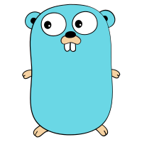

# Go语言简介和发展历史

## Go语言简介

Go语言，又称Golang，是一种由 Google 开发的静态、强类型、编译型、并发型的编程语言。它于2009年11月正式发布，并在 `Linux` 和 `Mac OS` X平台上进行了实现，后来追加了 `Windows` 系统下的实现。

Go语言具有以下特点：
- 简单易学：Go语言语法简洁，易于学习，即使是没有任何编程经验的人也能很快上手。
- 并发编程支持：Go语言内置了对并发编程的支持，使开发人员能够轻松编写高并发应用程序。
- 运行效率高：Go语言程序运行效率高，可媲美 `C` 或 `C++` 程序。
- 跨平台：Go语言程序可以跨平台运行，无需进行任何修改。
- 标准库丰富：Go语言拥有一个比较齐全的标准库，提供了很多常用的功能。
- 社区活跃：Go语言拥有一个活跃和回应快速的社区，社区贡献了大量高质量的第三方库包和应用。

Go语言的应用场景非常丰富，包括：
- Web开发：Go语言可以用于开发Web后端服务、Web应用程序、Web框架等。
- 系统编程：Go语言可以用于开发操作系统、网络编程、文件系统等。
- 云原生：Go语言是云原生应用开发的理想选择，因为它具有轻量级、高性能、易于部署等特点。
- 区块链：Go语言是区块链开发的热门语言之一，因为它具有高性能、安全可靠等特点。
- 其他：Go语言还可用于开发机器学习、数据分析、物联网等应用。

## Go语言发展历史

Go语言的发展历史可以追溯到2007年，当时 `Google` 的 `Rob Pike`、`Ken Thompson`、`Robert Griesemer` 等人开始着手设计一种新的编程语言。他们的目标是设计一种语言，能够满足以下需求：
- 简单易学：语言语法应该简单易懂，易于学习和使用。
- 高效：语言应该能够编译成高效的机器码，并支持并发编程。
- 安全：语言应该具有良好的内存安全性和类型安全性，以避免常见编程错误。
- 可扩展：语言应该易于扩展，以支持新的功能和需求。

经过多年的开发和完善，Go语言于2009年11月正式发布。此后，Go语言得到了迅速发展，并逐渐成为一种流行的编程语言。

Go语言的最新版本是Go 1.22，于2024年2月9日发布。

以下是一些 Go 语言发展历史上的重要里程碑：
- 2007年：Go语言项目启动。
- 2009年11月：Go语言1.0发布。
- 2012年3月：Go语言1正式发布。
- 2015年2月：Go语言1.5发布，引入了泛型。
- 2018年2月：Go语言1.11发布，引入了错误处理的新机制。
- 2021年2月：Go语言1.16发布，引入了模块系统。
- 2023年8月2日：Go语言1.19发布，引入了新的语言功能和标准库改进。

Go语言的未来发展前景广阔。随着云计算、人工智能、物联网等技术的快速发展，Go语言将发挥越来越重要的作用。

## Go语言能做什么？

Go语言是一种通用性编程语言，具有广泛的应用领域和用途。以下是Go语言的一些主要应用场景：

1. 后端开发：Go语言在后端开发方面非常强大。它提供了高效的并发编程模型和内置的网络库，使得构建高性能的Web应用程序和API变得简单。许多知名的Web框架（如Gin、Echo）和数据库驱动程序（如GORM、XORM）都是用 Go 语言编写的。

2. 分布式系统：Go语言对于构建分布式系统和并发处理非常适用。它的并发原语（如goroutines和channels）以及标准库中的相关功能使得编写高效的并发代码变得容易。因此，Go语言被广泛用于构建分布式系统、微服务架构和高吞吐量的服务器应用。

3. 命令行工具：由于 Go 语言的静态编译和跨平台特性，它非常适合用于构建命令行工具和系统脚本。许多知名的命令行工具（如Docker、Kubernetes）都是用Go语言编写的，因为它们需要高性能、可靠性和跨平台支持。

4. 数据科学和机器学习：虽然 Go 语言在数据科学和机器学习领域相对较新，但它的生态系统正在迅速发展。有一些用于数据处理和机器学习的优秀库（如Gonum、Gorgonia、Golearn），使得使用 Go 语言进行数据分析和机器学习变得更加便捷。

5. 网络编程和网络工具：Go语言的网络库提供了丰富的功能，使得构建网络应用和网络工具变得简单。它支持TCP、UDP、HTTP等协议，并提供了许多标准库和第三方库，用于处理网络通信、编解码、路由和安全等方面。

6. 云原生应用开发：Go语言在云原生应用开发领域得到广泛应用。云原生应用通常需要高性能、可伸缩性和容错性，而Go语言的并发模型和轻量级特性非常适合这些需求。许多云原生应用开发框架和工具（如Kubernetes、Prometheus）都使用Go语言编写。

总之，Go语言是一种非常灵活和多用途的编程语言，适用于各种领域的应用开发。它的简洁性、高性能和并发性使得它成为许多开发者的首选语言之一。无论是构建Web应用、分布式系统、命令行工具还是进行数据科学和机器学习，Go语言都具备很大的潜力和优势。

## Go语言开源项目有哪些？

云计算基础设施: [Kubernetes](https://github.com/kubernetes/kubernetes)、[Docker](https://github.com/docker/docker-ce)、[Podman](https://github.com/containers/podman)、[etcd](https://github.com/etcd-io/etcd)、[Consul](https://github.com/hashicorp/consul)等。

数据库: [TiDB](https://github.com/pingcap/tidb)、[InfluxDB](https://github.com/influxdata/influxdb)、[CockroachDB](https://github.com/cockroachdb/cockroach)等。

微服务: [go-kit](https://github.com/go-kit/kit)、[go-micro](https://github.com/micro/micro)、[go-kratos](https://github.com/go-kratos/kratos)、[go-zero](https://github.com/zeromicro/go-zero)等。

区块链技术: [以太坊](https://github.com/ethereum/go-ethereum)、[hyperledger](https://github.com/hyperledger)等。

## Go语言的logo和Go语言吉祥物

Go语言的logo很简洁的GO两个字母。

Go语言的吉祥物是一只名叫"Gopher"（地鼠）的角色。Gopher是 Go 语言社区广泛使用的一个可爱的形象，代表着 Go 语言的特性和文化。

Gopher的形象是一个呈现为橙色、带有大脑袋和大眼睛的地鼠。它被设计成友善、开朗和充满活力的形象，代表着 Go 语言的设计哲学和社区的精神。

Gopher的设计由美国艺术家Renee French创作，她在2009年的谷歌Go语言开发者大会（GopherCon）上首次展示了这个角色，并迅速受到了广大开发者的喜爱和认可。Gopher的形象在Go语言社区中随处可见，被用于官方文档、宣传资料、各种会议和活动的标识，以及社区成员的创意作品中。

Gopher的形象象征着Go语言社区的友善、开放和互助精神。它代表着Go语言社区成员之间的合作和分享，以及对简洁、高效和可靠编程的追求。Gopher也成为了Go语言社区的象征和标志，使得Go语言在开发者中间更加有趣和亲切。

总的来说，Gopher作为Go语言的吉祥物，代表着Go语言社区的特色和价值观，成为了Go语言社区的象征之一。无论是新手还是资深开发者，都可以通过Gopher这个可爱的形象感受到Go语言社区的热情和活力。

## Go语言创始人

Go语言的创始人是: Robert Griesemer（罗伯特.格利茨默）、Rob Pike（罗伯.派克）和Ken Thompson（肯.汤普森）。
- Rob Pike：曾是贝尔实验室（Bell Labs）的Unix团队，和Plan 9操作系统计划的成员。他与Thompson共事多年，并共创出广泛使用的UTF-8 字元编码。
- Ken Thompson：主要是B语言、C语言的作者、Unix之父。1983年图灵奖（Turing Award）和1998年美国国家技术奖（National Medal of Technology）得主。他与Dennis Ritchie是Unix的原创者。Thompson也发明了后来衍生出C语言的B程序语言。
- Robert Griesemer：在开发Go之前是Google V8、Chubby和HotSpot JVM的主要贡献者。